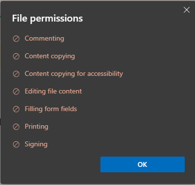

# PDFGuardian - Aplikasi Proteksi PDF dengan Password dan Permission Control

**PDFGuardian** adalah aplikasi Python untuk melindungi file PDF dengan password dan kontrol permission yang komprehensif. Aplikasi ini memungkinkan Anda mengatur siapa yang bisa membuka file, dan apa saja yang bisa dilakukan dengan file PDF tersebut.



## Fitur Utama

- **Password Protection**: Proteksi file PDF dengan user password dan owner password
- **Permission Control**: Kontrol granular untuk:
  - Commenting/Annotasi
  - Content Copying
  - Content Copying untuk Accessibility
  - Editing Konten
  - Filling Form Fields
  - Printing
  - Signing (aproksimasi)
- **Library Compatibility**: Mendukung PyPDF2 dan pypdf
- **Modular Architecture**: Struktur kode yang terorganisir dan mudah di-maintain
- **Interactive CLI**: Interface command-line yang user-friendly

## Persyaratan Sistem

- Python 3.7 atau lebih baru (disarankan Python 3.10+)
- PyPDF2 atau pypdf library
- Windows, macOS, atau Linux

---

## Tutorial Instalasi Lengkap

### 1. Instalasi Python

#### Windows:

1. **Download Python:**
   - Kunjungi [python.org/downloads](https://www.python.org/downloads/)
   - Download versi terbaru Python (misalnya Python 3.12.x)

2. **Install Python:**
   - Jalankan installer yang sudah didownload
   - **PENTING**: Centang "Add Python to PATH" di bagian bawah installer
   - Klik "Install Now"
   - Tunggu hingga instalasi selesai

3. **Verifikasi Instalasi:**
   ```bash
   python --version
   ```
   atau
   ```bash
   python3 --version
   ```

#### macOS:

1. **Menggunakan Homebrew (disarankan):**
   ```bash
   # Install Homebrew jika belum ada
   /bin/bash -c "$(curl -fsSL https://raw.githubusercontent.com/Homebrew/install/HEAD/install.sh)"

   # Install Python
   brew install python3
   ```

2. **Atau download dari python.org:**
   - Kunjungi [python.org/downloads](https://www.python.org/downloads/)
   - Download installer untuk macOS
   - Install seperti aplikasi macOS biasa

3. **Verifikasi:**
   ```bash
   python3 --version
   ```

#### Linux (Ubuntu/Debian):

```bash
# Update package list
sudo apt update

# Install Python 3
sudo apt install python3 python3-pip

# Verifikasi
python3 --version
```

### 2. Download Aplikasi PDFGuardian

#### Menggunakan Git (jika tersedia):

```bash
cd "D:\DATA KULIAH\Semester 5"
git clone https://github.com/zzkydev/PDFGuardian.git
cd PDFGuardian
```

#### Atau Manual Download:

1. Download semua file project
2. Extract ke folder `D:\DATA KULIAH\Semester 5\ToolsPDF`

### 3. Instalasi Dependencies

Buka Command Prompt / Terminal dan navigasikan ke folder project:

```bash
cd "D:\FileDirectory\PDFGuardian"
```

Install library yang diperlukan:

```bash
pip install PyPDF2
```

atau jika menggunakan Python 3:

```bash
pip3 install PyPDF2
```

**Alternatif (library yang lebih baru):**
```bash
pip install pypdf
```

### 4. Verifikasi Instalasi

Cek apakah semua dependencies terinstall dengan baik:

```bash
python -c "import PyPDF2; print('PyPDF2 installed successfully')"
```

### 5. Jalankan Aplikasi

```bash
python protect_pdf.py
```

atau

```bash
python3 protect_pdf.py
```

---

## Cara Penggunaan

### Langkah 1: Jalankan Aplikasi

```bash
python protect_pdf.py
```

### Langkah 2: Masukkan Path PDF

Aplikasi akan meminta path file PDF yang ingin diproteksi:

```
=== Proteksi Permission PDF (+ password user & owner) ===
Masukkan path file PDF: D:\Documents\myfile.pdf
```

### Langkah 3: Atur Permissions

Aplikasi akan menanyakan berbagai permission satu per satu:

```
=== Menu Izin (permissions) ===
Izinkan komentar/annotasi? [y/N]: n
Content copying diizinkan? [y/N]: n
Content copy for accessibility diizinkan? [Y/n]: y
Editing konten diizinkan? [y/N]: n
Filling form fields diizinkan? [Y/n]: y
Print diizinkan? [Y/n]: y
Signing diizinkan? (aproksimasi via annotasi & form) [y/N]: n
```

### Langkah 4: Set Password

```
=== Password settings ===
User password: diperlukan agar file hanya bisa dibuka jika mengisi password.
Owner password: diperlukan agar permission/setting dapat diubah (harus diisi).
Masukkan user password (kosong = file bisa dibuka tanpa password): ******
Masukkan owner password (wajib, jangan lupa simpan): ******
```

### Langkah 5: Konfirmasi dan Selesai

Aplikasi akan menampilkan ringkasan dan meminta konfirmasi:

```
=== Ringkasan Pengaturan Permissions ===
- Komentar/Annotasi: dilarang
- Content Copying: dilarang
- Copy for Accessibility: diizinkan
- Editing Konten: dilarang
- Filling Form Fields: diizinkan
- Print: diizinkan
- Signing (aproksimasi): dilarang
- User password: ada
- Owner password: diset (tidak ditampilkan)

Lanjutkan dan terapkan pengaturan ini? [Y/n]: y

Berhasil! File tersimpan: D:\DATA KULIAH\Semester 5\ToolsPDF\protected_myfile.pdf
```

---

## Arsitektur Modular

PDFGuardian dirancang dengan arsitektur modular untuk memudahkan maintenance dan pengembangan. Berikut struktur direktori:

```
ToolsPDF/
├── protect_pdf.py              # Main entry point
├── utils/                      # Utility modules
│   ├── __init__.py
│   ├── prompts.py             # User input prompts
│   └── password.py            # Password handling
├── pdf/                        # PDF processing modules
│   ├── __init__.py
│   ├── compatibility.py       # PyPDF2/pypdf compatibility
│   ├── permissions.py         # Permission configuration
│   └── encrypt.py             # PDF encryption logic
├── README.md                   # Dokumentasi ini
└── Tampilan_File_Permissions.png  # Screenshot contoh
```

### Penjelasan Setiap Modul

#### 1. `protect_pdf.py` - Main Entry Point

**Fungsi**: File utama aplikasi yang mengorkestrasikan semua modul

**Tanggung Jawab**:
- Menerima input path file PDF dari user
- Validasi file PDF (format dan keberadaan)
- Mengkoordinasikan flow aplikasi dari awal sampai akhir
- Menentukan output path dengan handling file yang sudah ada
- Error handling dan user feedback

**Fungsi Utama**:
- `main()`: Fungsi utama yang menjalankan seluruh flow aplikasi
- `get_output_path()`: Menentukan path output file dengan handling konflik nama

**Cara Kerja**:
```python
1. Meminta input path PDF dari user
2. Validasi file (format .pdf, file exists, bisa dibuka)
3. Panggil ask_permissions() untuk konfigurasi permission
4. Panggil ask_password() untuk user dan owner password
5. Tampilkan ringkasan dan minta konfirmasi
6. Panggil encrypt_pdf() untuk enkripsi
7. Simpan file dan tampilkan notifikasi sukses
```

---

#### 2. `utils/prompts.py` - User Input Prompts

**Fungsi**: Menangani semua interaksi dengan user untuk mendapatkan input

**Tanggung Jawab**:
- Menyediakan fungsi prompt untuk input boolean (yes/no)
- Formatting output boolean ke bahasa Indonesia
- Validasi input user
- Handling default values

**Fungsi**:
- `prompt_bool(label, default=None)`:
  - Meminta input yes/no dari user
  - Mendukung default value ([Y/n] atau [y/N])
  - Loop hingga mendapat input yang valid
  - Return: `True` atau `False`

- `human_bool(b)`:
  - Convert boolean ke string Indonesia
  - Return: "diizinkan" atau "dilarang"

**Contoh Penggunaan**:
```python
from utils.prompts import prompt_bool, human_bool

# Meminta konfirmasi
allow_print = prompt_bool("Print diizinkan?", True)  # [Y/n]

# Convert ke string
status = human_bool(allow_print)  # "diizinkan" atau "dilarang"
print(f"Status print: {status}")
```

---

#### 3. `utils/password.py` - Password Handling

**Fungsi**: Menangani input password dengan aman

**Tanggung Jawab**:
- Meminta password dari user tanpa menampilkannya di layar
- Validasi password (kosong atau tidak)
- Konfirmasi untuk password kosong
- Fallback ke input biasa jika getpass tidak tersedia

**Fungsi**:
- `ask_password(prompt_text, allow_empty=False)`:
  - Menggunakan `getpass` untuk input password yang aman
  - Jika `allow_empty=False`, loop hingga password tidak kosong
  - Konfirmasi jika user ingin password kosong
  - Fallback ke `input()` jika `getpass` gagal

**Keamanan**:
- Password tidak muncul di terminal saat diketik
- Konfirmasi double-check untuk password kosong
- Exception handling untuk berbagai environment

**Contoh Penggunaan**:
```python
from utils.password import ask_password

# Meminta user password (boleh kosong)
user_pwd = ask_password("User password", allow_empty=True)

# Meminta owner password (wajib diisi)
owner_pwd = ask_password("Owner password", allow_empty=False)
```

---

#### 4. `pdf/compatibility.py` - Library Compatibility Layer

**Fungsi**: Menjembatani kompatibilitas antara PyPDF2 dan pypdf

**Tanggung Jawab**:
- Deteksi library PDF yang terinstall (PyPDF2 atau pypdf)
- Import classes dan constants yang sesuai
- Menyediakan fallback permission bitmasks
- Menyediakan interface yang konsisten untuk kedua library

**Exports**:
- `PDFReader`: Class untuk membaca PDF
- `PDFWriter`: Class untuk menulis PDF
- `Permissions`: Enum permissions (jika tersedia)
- `ImportSource`: String nama library yang digunakan
- `PERM_FLAGS_AVAILABLE`: Boolean apakah Permissions enum tersedia
- Permission bitmask constants: `PERM_PRINT`, `PERM_MODIFY_CONTENTS`, dll.

**Cara Kerja**:
```python
1. Try import PyPDF2
   - Import PdfReader dan PdfWriter
   - Try import Permissions dari PyPDF2.constants
2. Jika PyPDF2 gagal, try import pypdf
   - Import PdfReader dan PdfWriter
   - Try import Permissions dari pypdf
3. Jika keduanya gagal, exit dengan error message
4. Set flag PERM_FLAGS_AVAILABLE berdasarkan Permissions availability
5. Define fallback bitmask constants
```

**Mengapa Penting?**:
- PyPDF2 dan pypdf memiliki API yang sedikit berbeda
- Beberapa versi tidak menyediakan Permissions enum
- Modul ini memastikan aplikasi bisa berjalan dengan kedua library

---

#### 5. `pdf/permissions.py` - Permission Configuration

**Fungsi**: Mengelola konfigurasi permission PDF

**Tanggung Jawab**:
- Menyimpan konfigurasi permission dalam dataclass
- Convert konfigurasi ke format yang dibutuhkan library
- Interface untuk menanyakan permission ke user
- Menampilkan ringkasan permission

**Classes**:
- `PermissionConfig` (dataclass):
  - Menyimpan 7 boolean flags untuk berbagai permission
  - Method `display_summary()`: Tampilkan ringkasan setting
  - Method `to_permission_set()`: Convert ke set untuk modern API
  - Method `to_permission_flag()`: Convert ke integer bitmask

**Fungsi**:
- `ask_permissions()`:
  - Menanyakan semua permission ke user secara interaktif
  - Return: `PermissionConfig` object

**Permission yang Dikelola**:
1. **allow_comments**: Izin untuk menambah komentar/annotasi
2. **allow_copy**: Izin untuk copy konten
3. **allow_accessibility**: Izin copy untuk accessibility tools
4. **allow_edit**: Izin untuk edit konten PDF
5. **allow_fill**: Izin untuk mengisi form fields
6. **allow_print**: Izin untuk print dokumen
7. **allow_sign**: Izin untuk signing (aproksimasi)

**Contoh Penggunaan**:
```python
from pdf.permissions import ask_permissions

# Dapatkan konfigurasi dari user
permissions = ask_permissions()

# Tampilkan ringkasan
permissions.display_summary()

# Convert untuk enkripsi
perm_set = permissions.to_permission_set()  # Untuk modern API
perm_flag = permissions.to_permission_flag()  # Untuk legacy API
```

---

#### 6. `pdf/encrypt.py` - PDF Encryption Logic

**Fungsi**: Menangani proses enkripsi PDF dengan password dan permissions

**Tanggung Jawab**:
- Membaca PDF input
- Menerapkan enkripsi dengan password
- Menerapkan permission restrictions
- Menulis PDF terenkripsi ke output
- Validasi PDF

**Fungsi Utama**:

1. `encrypt_pdf(input_path, output_path, user_password, owner_password, permissions)`:
   - Fungsi utama untuk enkripsi PDF
   - Membaca semua pages dari input PDF
   - Menerapkan enkripsi dengan password dan permissions
   - Menulis ke output file
   - Menangani dua jenis API (permission set dan bitmask)

2. `_encrypt_with_permission_set(writer, user_pwd, owner_pwd, permissions)`:
   - Internal function untuk modern API (PyPDF2 dengan Permissions enum)
   - Menggunakan permission set
   - Multiple fallback jika signature berbeda

3. `_encrypt_with_permission_flag(writer, user_pwd, owner_pwd, permissions)`:
   - Internal function untuk legacy API (bitmask integer)
   - Menggunakan integer flags untuk permissions
   - Fallback untuk berbagai signature encrypt()

4. `validate_pdf(pdf_path)`:
   - Validasi apakah file adalah PDF yang valid
   - Try membuka dan membaca first page
   - Return: `True` jika valid, `False` jika tidak

**Cara Kerja Enkripsi**:
```python
1. Baca PDF dengan PDFReader
2. Buat PDFWriter baru
3. Copy semua pages ke writer
4. Tentukan metode enkripsi (permission set vs bitmask)
5. Panggil writer.encrypt() dengan parameters yang sesuai
6. Tulis encrypted PDF ke file output
```

**Exception Handling**:
- Multiple try-except untuk handle berbagai signature API
- Fallback ke enkripsi password-only jika permission gagal
- Clear error messages untuk user

---

## Keamanan dan Limitasi

### Keamanan:
- Password menggunakan `getpass` untuk input yang aman (tidak terlihat di terminal)
- Owner password wajib diisi untuk mencegah perubahan setting
- User password opsional (jika kosong, file bisa dibuka tanpa password)

### Limitasi:
- **Permission bersifat advisory**: Beberapa PDF reader bisa bypass permission restrictions
- **Bukan enkripsi end-to-end**: Setelah dibuka dengan password, konten bisa diakses
- **Tidak cocok untuk dokumen sangat sensitif**: Untuk proteksi maksimal, gunakan DRM atau viewer terkendali

### Best Practices:
1. **Gunakan owner password yang kuat**: Minimal 12 karakter, kombinasi huruf, angka, simbol
2. **Simpan password dengan aman**: Gunakan password manager
3. **Kombinasikan dengan permission restrictions**: Jangan hanya andalkan password
4. **Backup file original**: Simpan file asli sebelum enkripsi

---

## Troubleshooting

### Error: `TypeError: unsupported operand type(s) for |: 'type' and 'NoneType'`

**Penyebab**: Python version < 3.10 tanpa `from __future__ import annotations`

**Solusi**: Sudah fixed dengan menambahkan import di semua file

### Error: `Gagal mengimpor PyPDF2 atau pypdf`

**Penyebab**: Library belum terinstall

**Solusi**:
```bash
pip install PyPDF2
# atau
pip install pypdf
```

### Error: `struct.error: required argument is not an integer`

**Penyebab**: Permission flag yang tidak valid

**Solusi**: Sudah fixed dengan menghapus conditional `if permissions_flag else None`

### File tidak bisa dibuka setelah enkripsi

**Penyebab**: Password salah atau PDF reader tidak mendukung

**Solusi**:
- Pastikan menggunakan password yang benar
- Coba PDF reader lain (Adobe Reader, Foxit, dll)
- Check apakah file output benar-benar terenkripsi

---

## FAQ (Frequently Asked Questions)

### 1. Apa perbedaan user password dan owner password?

- **User Password**: Password untuk membuka dan membaca file PDF. Jika kosong, file bisa dibuka tanpa password.
- **Owner Password**: Password untuk mengubah permission dan security settings. Wajib diisi dan harus dijaga kerahasiaannya.

### 2. Apakah bisa enkripsi tanpa password?

Ya, Anda bisa membiarkan user password kosong. Namun owner password tetap wajib untuk melindungi permission settings.

### 3. Bagaimana cara menghilangkan proteksi dari PDF?

Anda memerlukan owner password untuk menghilangkan proteksi. Gunakan PDF editor seperti Adobe Acrobat dengan owner password untuk remove security.

### 4. Apakah permission benar-benar aman?

Permission PDF bersifat advisory dan bisa di-bypass oleh beberapa tools. Untuk dokumen sangat sensitif, gunakan solusi DRM profesional.

### 5. Kenapa file output lebih besar dari input?

Proses enkripsi menambahkan metadata dan security information ke PDF, yang sedikit meningkatkan ukuran file.

### 6. Apakah bisa batch processing banyak file?

Saat ini aplikasi hanya support satu file per eksekusi. Untuk batch processing, Anda bisa modify source code atau jalankan multiple times.

---

## Kontribusi

Kontribusi sangat diterima! Silakan:
1. Fork repository
2. Buat branch untuk feature (`git checkout -b feature/AmazingFeature`)
3. Commit changes (`git commit -m 'Add some AmazingFeature'`)
4. Push ke branch (`git push origin feature/AmazingFeature`)
5. Buat Pull Request

---

## Lisensi

Project ini dibuat untuk keperluan edukasi.

---

## Kontak & Support

Untuk pertanyaan, bug reports, atau feature requests, silakan buat issue di repository.

---

## Changelog

### Version 1.0.0 (Current)
- Initial release
- Modular architecture
- Support PyPDF2 dan pypdf
- Interactive CLI
- Comprehensive permission control
- Password protection (user & owner)

---

**PDFGuardian** - Melindungi PDF Anda dengan Mudah dan Aman
